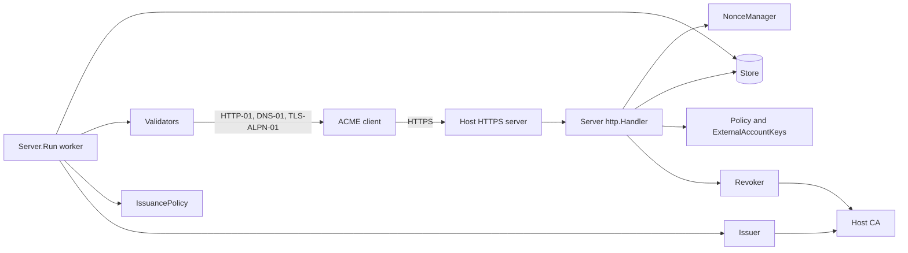
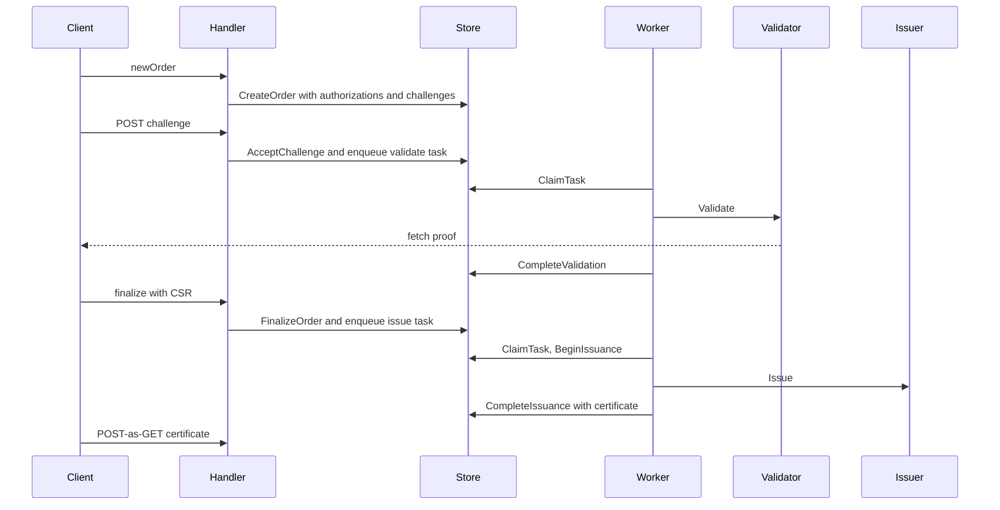

# Architecture

go-acme-server is a protocol layer. It turns ACME requests into stored resources and background
tasks. It turns completed tasks into validated authorizations and issued certificates. Every
side effect outside the protocol goes through an interface the host application implements.

## Components

| Component | Provided by | Role |
| --- | --- | --- |
| `Server` | Library | Parses and verifies requests, serves resources, enqueues work |
| `Server.Run` | Library, started by the host | Claims tasks, calls validators and the issuer, commits results |
| `Store` | Host | Persists resources and tasks atomically. `memstore` for tests |
| `NonceManager` | Host | Replay protection. `nonce` for a single process |
| `Validator` | Host or `challenge` | Proves control of one identifier per challenge type |
| `Issuer` and `Revoker` | Host | Sign and revoke through the CA |
| `Policy` and `IssuancePolicy` | Host, optional | Refuse accounts, orders or issuance |
| `ExternalAccountKeys` | Host, optional | MAC keys for external account binding |
| `RenewalAdvisor` | Host, optional | Renewal windows for RFC 9773 |

The handler and the worker communicate only through the store. They may run in one process or in
different processes. Several workers may share one store.

## Request handling

Every POST is a JWS. The handler checks the content type, reads at most `Config.MaxRequestBody`
bytes, parses the JWS, consumes the nonce, compares the protected `url` with the request URL built
from `Config.BaseURL`, resolves the signing key from the embedded JWK or the account `kid` and
verifies the signature. Only then is the payload interpreted. A failure at any step is a problem
document with a fresh `Replay-Nonce`.

Resources live under the base URL at fixed paths, listed in [Endpoints](reference/endpoints.md).
Resource IDs are opaque and random.

## The order lifecycle

**Order creation.** Identifiers are normalized and checked for duplicates and limits. `Policy.NewOrder`
may refuse the order or adjust the requested validity. The store creates the order, one pending
authorization per identifier and one challenge per applicable type in a single operation. There is
no pre-authorization, so every order gets fresh authorizations.

**Challenge response.** A POST to a pending challenge moves it to `processing` and enqueues a
validation task in the same store operation. Repeated responses are harmless. The account key
thumbprint is captured on the challenge, so a later key rollover does not change an in-flight
validation.

**Validation.** The worker claims the task with a lease, checks that the authorization is still
pending and the account still valid, then calls the validator under `WorkerConfig.TaskTimeout`. A
returned `*Problem` is final and makes the challenge and authorization invalid. Any other error is
a transport failure and is retried with exponential backoff until `WorkerConfig.MaxAttempts` or the
authorization expiry. Success makes the authorization valid for `Config.AuthorizationLifetime`.
When the last authorization becomes valid the order becomes `ready`.

**Finalization.** The CSR must be self-signed with an accepted key that is not the account key and
must request exactly the order's identifiers. The order moves to `processing` and an issuance task
is enqueued. A repeated finalization with the same CSR is accepted and a different CSR is refused.

**Issuance dispatch.** Before the first CA call the worker records an `IssuanceState` on the order:
the operation ID, the validation evidence and the earliest order or authorization expiry as the
deadline. `IssuancePolicy` runs before that record is written. `BeginIssuance` stores the decision
only if the order, the account and every authorization are unchanged since they were read. From
then on every attempt presents the same `OperationID`.

**Issuance.** The issuer returns a chain, `Pending` with a retry delay or a `Rejected` problem. A
chain is checked before publication: the leaf key matches the CSR, the identifiers match the order,
the validity fits the accepted window, the CA basic constraint matches what was authorized and each
element signs the previous one. A chain that fails is kept in `Order.UnpublishedResult` and the
order becomes invalid. An error from the issuer is retried without an attempt limit, because the CA
may already have issued. Once the deadline has passed the request carries `RecoveryOnly` and the
issuer may only return an existing result.

**Certificate.** The certificate resource is the base64url SHA-256 digest of the leaf. The response
carries the leaf followed by the chain as `application/pem-certificate-chain`.

## Durability and concurrency

Every resource has a `Revision` that increases on each update. Updates present the revision they
read and the store returns `ErrRevisionMismatch` when it moved. Tasks are claimed with a lease and a
`Fence` that increases on every claim. Completion operations present the fence and are refused when
another claim superseded them. This is what lets a worker die mid-task and another worker take over
without committing stale results.

The worker never interrupts a task in flight when its context is canceled. Shutdown waits for the
current tasks or lets their leases lapse for another worker.

## What the host decides

The library makes no policy decisions beyond the protocol. It does not choose validity periods,
key usages, rate limits or which identifiers a CA may issue for. Those belong in `Policy`,
`IssuancePolicy` and the CA behind `Issuer`. The [security model](security/security-model.md) lists
the boundaries in detail.
