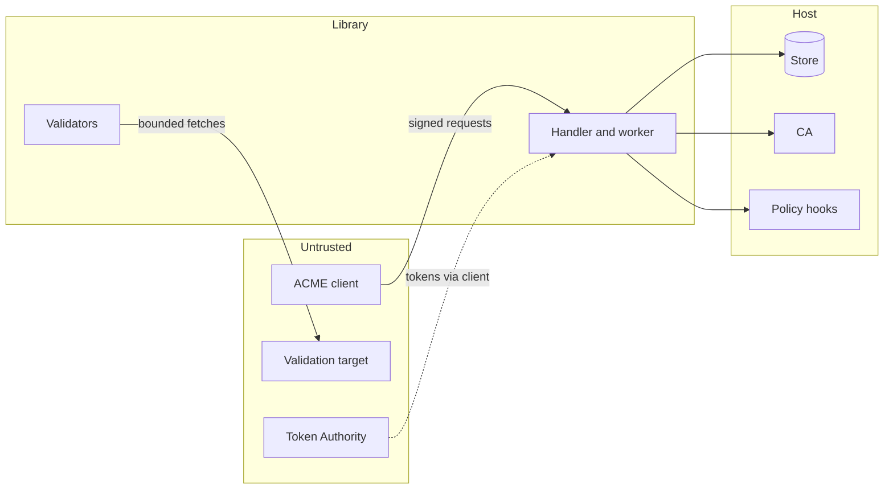

# Security model

This page states what the library protects against, what it assumes about the host and where the
host must add its own controls. It is written for the person deciding whether the library fits a
CA's security requirements.

## Trust boundaries

Clients, validation targets and Token Authorities are untrusted. The store, the CA and the policy
hooks are trusted host code. The library sits between them and applies the protocol.

## What the library enforces

**Request authentication.** Every POST is a JWS verified against the embedded key or the stored
account key. The protected `url` must equal the request URL built from the base URL, so a request
captured for one server cannot be replayed against another path or host. The nonce is consumed
before the payload is read and a nonce is valid exactly once. `newAccount` requires an embedded
key and every other resource requires a `kid`, as RFC 8555 section 6.2 demands.

**Key policy.** Account keys must be ES256, ES384, ES512, RS256 or EdDSA keys and CSR keys must be
RSA 2048 to 4096 bits, P-256, P-384, P-521 or Ed25519. The CSR key must differ from the account key.

**Authorization before issuance.** A certificate is issued only for an order whose every
authorization is valid, whose CSR requests exactly the order's identifiers and whose CA basic
constraint matches what the authorizations granted. The decision is stored before the CA is
called. The deadline stored with it stops late signing.

**Validation egress.** The bundled validators resolve names through configured resolvers only,
refuse special-purpose and private destinations unless allowed, recheck every redirect, ignore
proxy environment variables, bound every read and never include fetched content in error details.
The rules are in [Challenge validators](../guide/validators.md).

**Bounded parsing.** JSON is limited in size, nesting depth and duplicate members. JWS, JWK, DNS
responses, TLS handshakes and TLS-ALPN proofs are parsed with explicit limits. Those parsers
have fuzz targets that CI runs.

**Publication checks.** A chain from the CA is served only if the leaf key, identifiers, validity,
CA constraint and chain signatures match what was authorized. Anything else is retained for the
host and never served.

**Revocation authority.** Only the issuing account, the certificate key or an account that proved
every identity the certificate asserts may revoke. The operation is recorded before the CA call and
survives a client disconnect.

**Idempotent host calls.** The issuer and the revoker receive a durable operation ID on every
attempt, so a retry after a lost response cannot produce a second certificate or a second
revocation if the host deduplicates as the contract requires.

## What the host must provide

| Concern | Host responsibility |
| --- | --- |
| Transport security | HTTPS at the origin `Config.BaseURL` names. The library never sees the connection |
| Durable, atomic storage | A `Store` that passes `storetest` and keeps its uniqueness and revision guarantees under concurrency |
| CA controls | Key protection, serial uniqueness, certificate policy and CRL or OCSP publication behind `Issuer` and `Revoker` |
| Deduplication | `Issuer` and `Revoker` must deduplicate by `OperationID` |
| Who may register and order | `Policy`, external account binding keys and terms of service |
| Rate limits and abuse controls | `Policy` and `IssuancePolicy`. The library has no built-in limits |
| CAA and name policy | `IssuancePolicy` or the CA. The library does not check CAA |
| Token Authority trust | `challenge.TokenAuthorities` for `tkauth-01` |
| Unpublished result reconciliation | Query orders with `UnpublishedResult` and act in the CA |
| Nonce coordination | A shared `NonceManager` when several replicas serve one origin |
| Retention and audit | Reading and pruning the store |

## Threats and treatment

| Threat | Treatment |
| --- | --- |
| Request replay | Single-use nonces, URL binding of every signature |
| Account takeover through key rollover | The inner JWS must be signed by the new key over the old key and the account URL, and the new key must not own another account |
| Issuance for a name the client does not control | Fresh authorizations per order, validators that fetch proof from the resolved destination only, CSR identifiers compared with the order |
| SSRF through validation | Egress policy on every resolved address and every redirect, no proxy use, no destination ports other than 80 and 443 |
| Resource exhaustion through requests | Body size, JSON depth, identifier count, contact count and DNS or TLS read limits. Rate limiting is the host's |
| Double issuance after a crash | Dispatch decision stored before the CA call, operation ID reuse, fenced task completion |
| Serving a certificate the CA got wrong | Publication checks, retained unpublished results |
| Forged Authority Tokens | Signature under a certificate the host's trust source returns, claim checks against the challenge identifier and account key, no fetch of `x5u` |
| Replacing another account's certificate | `replaces` must name a certificate of the same account that shares an identifier |

## Reporting

Report suspected vulnerabilities privately as
[SECURITY.md](https://github.com/misiektoja/go-acme-server/blob/main/SECURITY.md) describes. Only
the latest release receives fixes.
